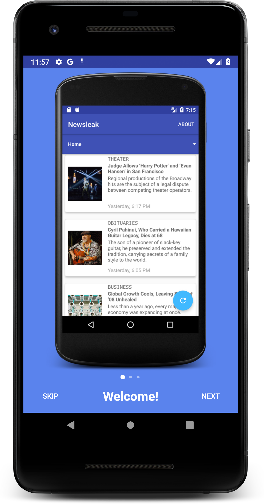
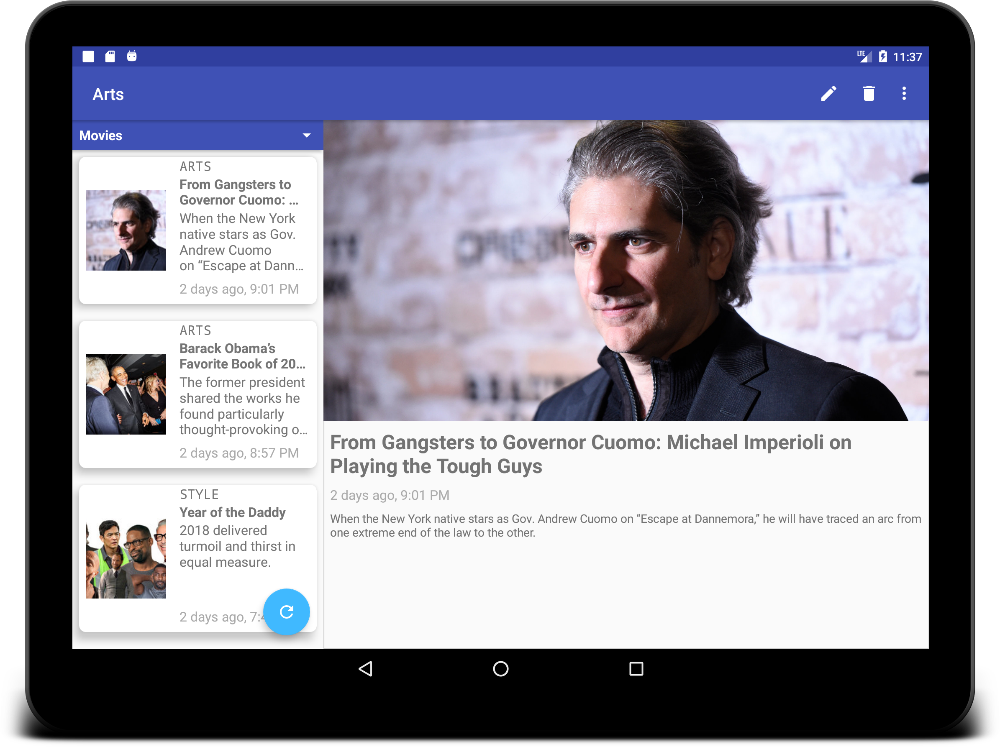

# newsleak
Android news aggregator app using [NY Times Api](https://developer.nytimes.com/).

This is an educational project of the [Android Academy MSK](https://habr.com/post/420573/) in order to learn the Android SDK and relevant Android libraries.
This repository contains a detailed sample app that implements MVP architecture.

## Screenshots

## Libraries
* [Android X](https://developer.android.com/jetpack/androidx/)
* [Dagger 2](http://google.github.io/dagger/)
* [Glide](https://github.com/bumptech/glide)
* [Moxy](https://github.com/Arello-Mobile/Moxy)
* [Retrofit 2](http://square.github.io/retrofit/)
* [Room](https://developer.android.com/topic/libraries/architecture/room)
* [RxJava](https://github.com/ReactiveX/RxJava) and [RxAndroid](https://github.com/ReactiveX/RxAndroid)
